# PASKO PERFORMANCE PLATFORM — VOLLEYBALL v1.0.0

## Полное руководство пользователя

Это локальное Windows-приложение для ведения состава волейбольной команды, тестирований, контроля качества, целей, аналитики и резервного копирования. Приложение работает через защищённое Electron-окно и локальную PostgreSQL 16; рабочие данные не требуют облачного сервиса.

## 1. Основные понятия

- **Club Workspace** — рабочая область реального клуба.
- **Demo Workspace** — отдельная область с вымышленными данными; отмечена меткой «ДЕМОНСТРАЦИОННЫЕ ДАННЫЕ».
- **Организация → команда → сезон** — контекст, в котором отображаются данные.
- **TestSession** — факт тестирования игрока в дату и фазу.
- **TestResult** — каноническое измерение метрики. Значения в профиле, PB, аналитике, сравнении и целях берутся из подтверждённых результатов.
- **QC** — проверка качества результата. Результат со статусом `FAILED` не участвует в расчётах до ручной проверки и исправления.
- **Референс** — утверждённая база интерпретации результата.

## 2. Установка, First Run и вход

Установщик размещает приложение в пользовательском каталоге Windows. При первом запуске приложение подготавливает локальную базу данных и открывает мастер первоначальной настройки.

В мастере:

1. Укажите название клуба.
2. Создайте локального администратора и надёжный пароль.
3. Сохраните показанный Recovery Key в отдельном защищённом месте.
4. Завершите настройку и войдите.

Recovery Key показывается только в предусмотренном UI. Не фотографируйте его для документации. При утере пароля откройте экран восстановления, введите Recovery Key, задайте новый пароль и войдите снова.

Обычный вход выполняется локально. После серии неверных попыток вход временно ограничивается. Кнопка **Выйти** завершает локальную сессию и переводит на страницу входа.

## 3. Оболочка приложения

Слева расположено меню, сверху — текущие команда, сезон, дата и выход. Меню сворачивается кнопкой у логотипа.

Разделы: обзор, игроки, состав тела, цели, тестирование, сессии, динамика, сравнение, отчёты, импорт, контроль данных, тесты, референсы, протоколы, оборудование и настройки.

### Команда и сезон

Нажмите контекст в верхней панели. Выберите организацию, команду и сезон, затем **Продолжить**. Создание новой команды или сезона выполняется на той же странице.

## 4. Обзор команды

Dashboard показывает число игроков, травмы, сессии и результаты за последние 30 дней, цели и последние сессии. Период «за 30 дней» ограничен текущим моментом: будущие измерения не считаются историческими.

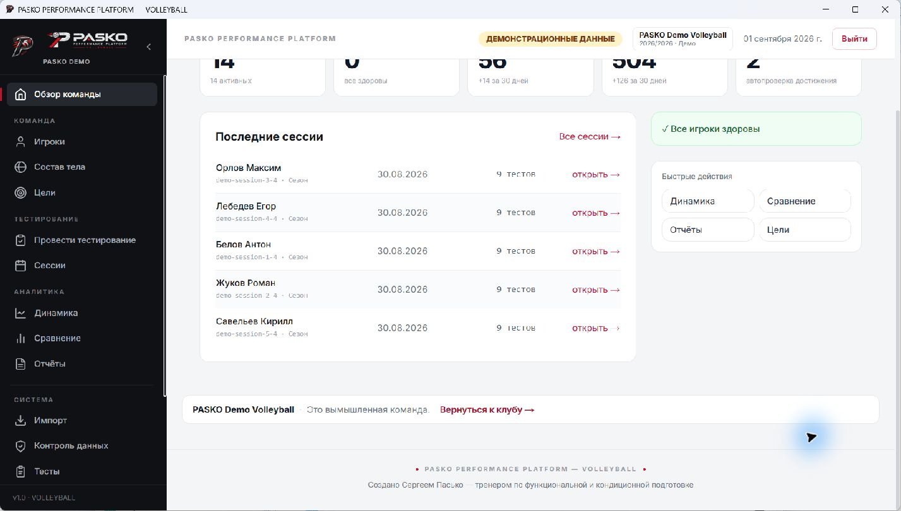

Если карточка пуста, создайте игроков и проведите первое тестирование. Быстрые действия ведут к аналитике, сравнению, отчётам и целям.

## 5. Игроки

Список поддерживает статусы: активен, травмирован, ограничения, неактивен. Нажмите игрока для карточки. Для нового игрока обязательны фамилия и имя; код должен быть уникален в допустимой области.

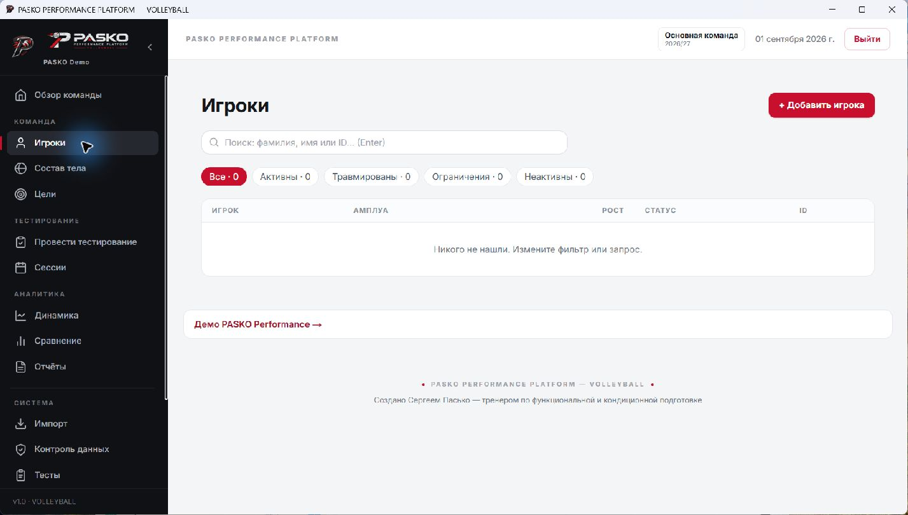
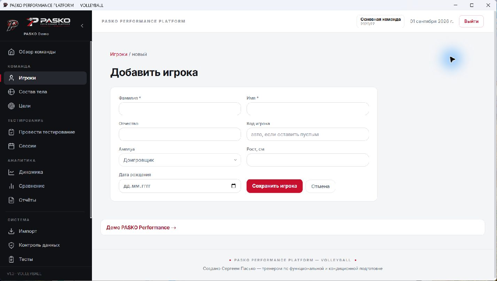
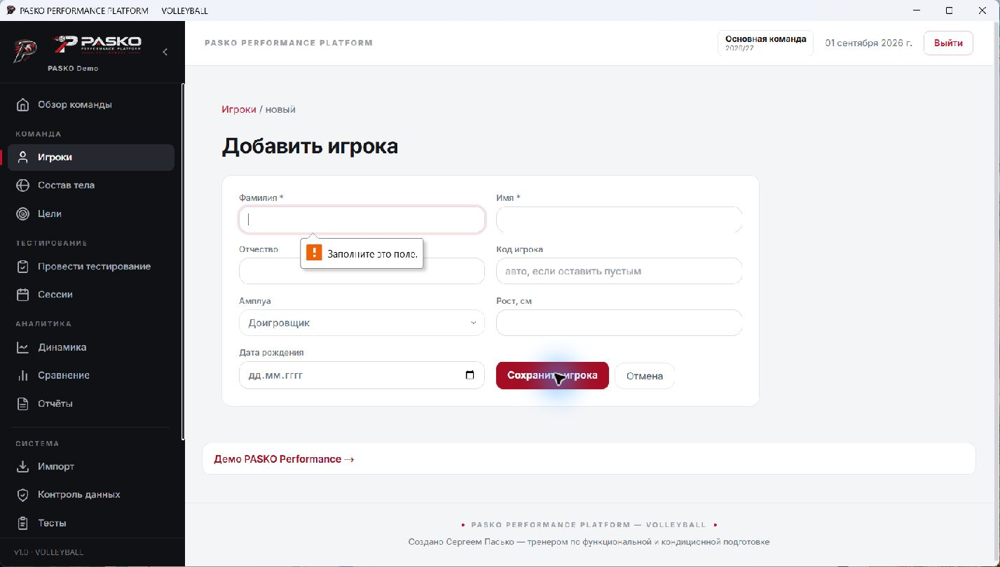

Редактирование меняет анкету, но не переписывает историю измерений. Архивация скрывает игрока из активной работы, сохраняя связанные данные; восстановление возвращает запись. Дубликат должен быть устранён изменением уникальных данных, а не удалением истории.

## 6. Карточка и профиль игрока

Карточка содержит анкету, дату последнего подтверждённого тестирования, radar, сильные стороны, зоны роста, PB, историю сессий и цели.

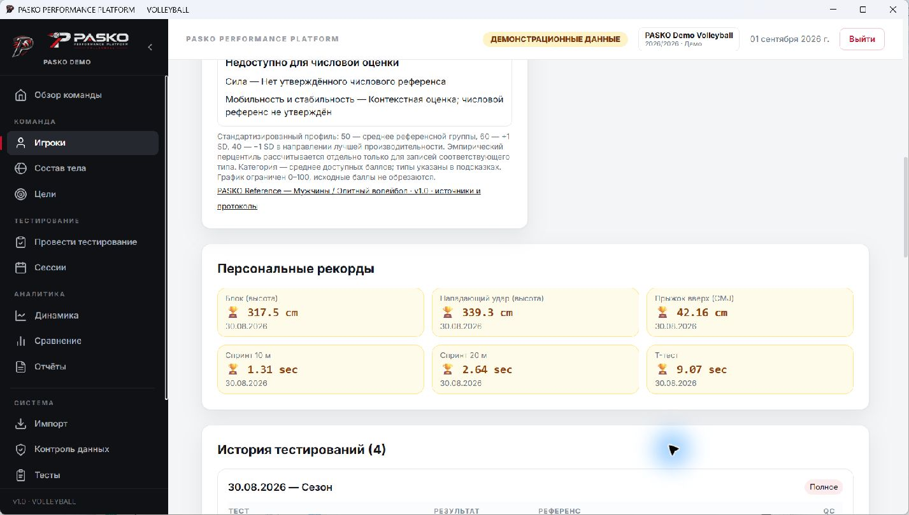
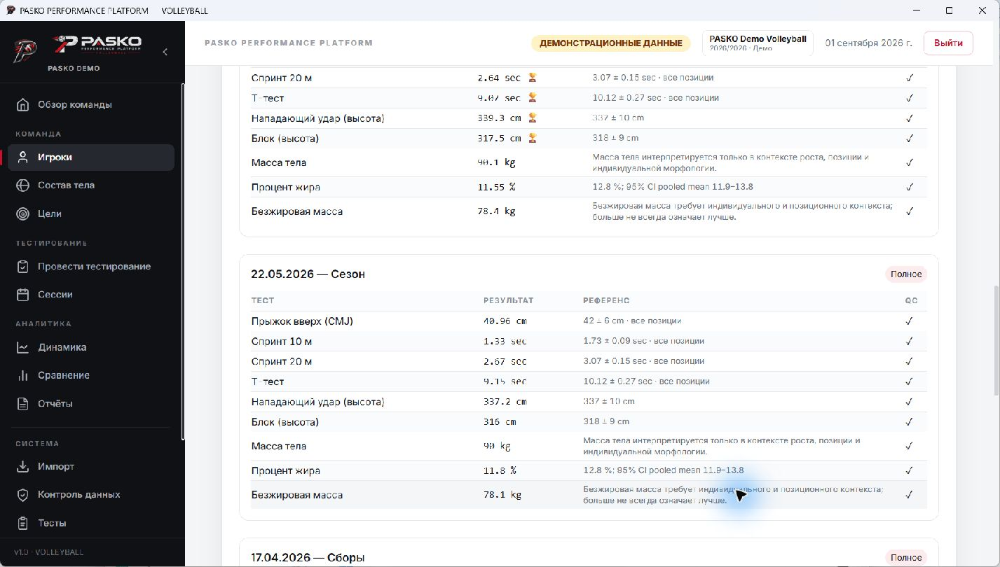

### ProfileScore

Для опубликованного распределения используется ориентированный z-score:

- выше — лучше: `(результат − mean) / SD`;
- ниже — лучше: `(mean − результат) / SD`;
- ProfileScore: `50 + 10 × z`.

Это не percentile. Для `EMPIRICAL_PERCENTILE` показывается «Эмпирический перцентиль». Для `PUBLISHED_DISTRIBUTION` — «Стандартизированный балл по опубликованным среднему и SD».

Категория усредняет только доступные совместимые числовые метрики. Надпись `1/2` означает частичное покрытие. Отсутствующее значение не интерпретируется как нулевой результат. Сила и мобильность/стабильность без числового покрытия вынесены в блок «Недоступно для числовой оценки».

Референс сопоставляется по виду спорта, метрике и единице измерения, полу и, если указано, возрасту и позиции, а также версии источника. Несовместимый референс не используется только ради заполнения диаграммы.

## 7. Состав тела

Раздел показывает последние подтверждённые исторические значения массы, процента жира и безжировой массы и их динамику.

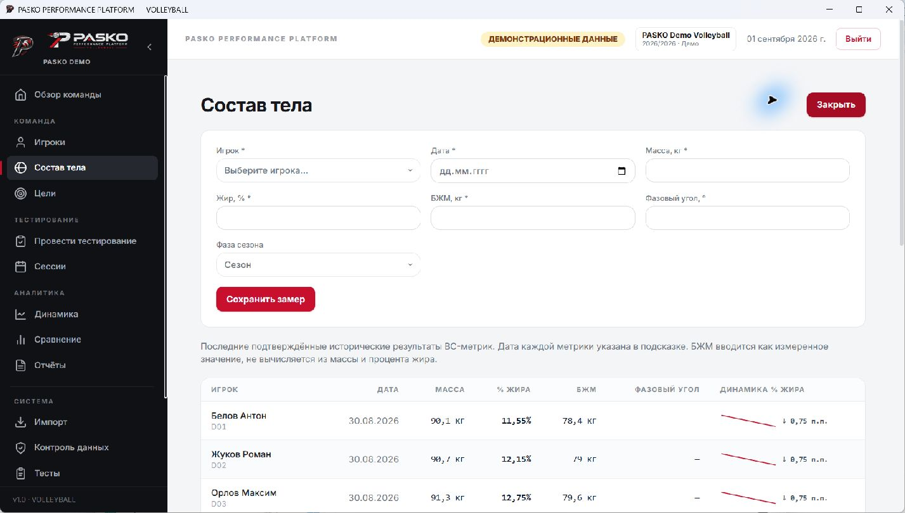

Безжировая масса вводится как измеренное значение и не вычисляется автоматически из массы и процента жира. Заполняйте только показатели, полученные утверждённым протоколом, с правильной датой.

## 8. Цели

Цели принадлежат игроку и в v1.0 действуют между сезонами. Текущее значение — последний подходящий QC-подтверждённый исторический результат. Дата достижения цели определяется по первому подходящему результату после её создания; будущий результат не может задним числом выполнить цель.

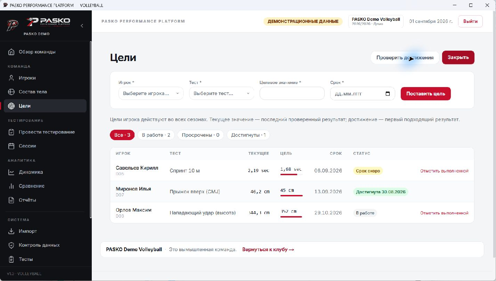

Укажите игрока, тест, целевое значение и срок. Направление сравнения определяется настройками теста: «выше — лучше», «ниже — лучше» или контекстная оценка. Не отмечайте цель выполненной вручную без проверки первичных данных.

## 9. Командное тестирование

Форма предназначена для одного теста, всей команды и одной даты. Пустое поле означает, что игрок не тестировался.

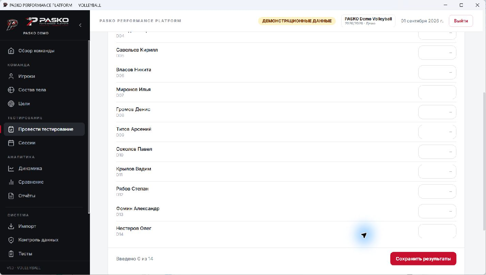

1. Выберите тест, дату и фазу.
2. Введите результаты в указанной единице и допустимом диапазоне.
3. Проверьте число заполненных строк.
4. Сохраните. Сессии создаются автоматически.

## 10. Сессии

Список фильтруется по фазе и показывает игрока, дату, число тестов и QC.

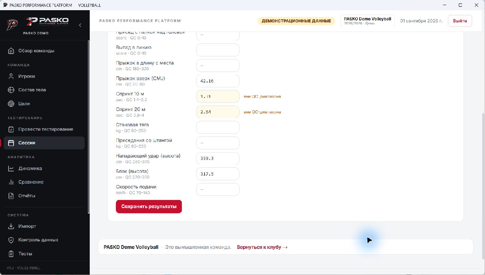

В карточке можно корректировать допустимые данные сессии и результаты. Удаление сессии является обратимым: запись скрывается из активной работы, а восстановление возвращает её вместе со связанными данными.

## 11. Контроль данных (QC)

QC выявляет подозрительные значения и конфликтующие результаты. Результат со статусом `FAILED` не участвует в целях, аналитике, сравнении, профиле игрока и расчёте персональных рекордов. После ручной проверки подтверждённый результат снова участвует в связанных расчётах.

Перед разрешением сравните единицу, диапазон, дату, игрока, тест и первичный протокол. Не подтверждайте значение только ради заполнения отчёта.

## 12. Динамика и сравнение

Динамика строится по подтверждённым историческим измерениям до текущего момента. Выберите игрока и тест; отсутствие данных показывается явно.

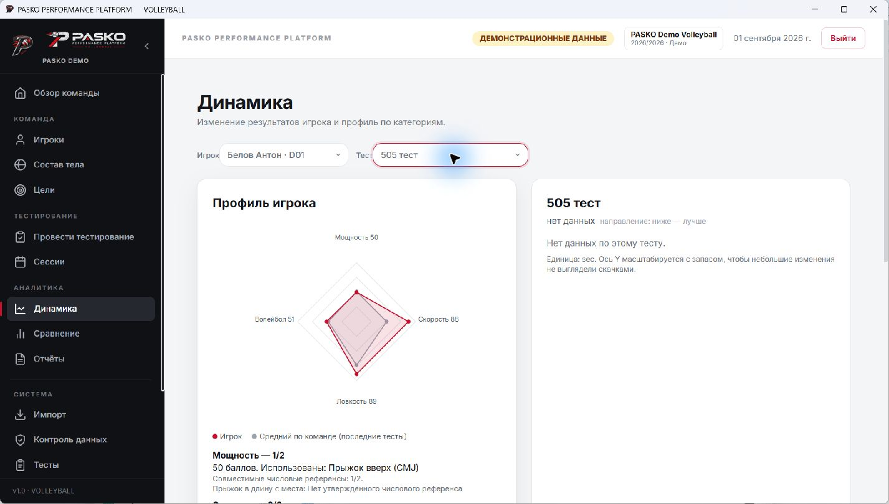

Сравнение использует последние подтверждённые результаты двух игроков. Зелёным отмечается лучший абсолютный результат с учётом направления теста; контекстные метрики автоматически не ранжируются.

## 13. Отчёты и экспорт

Отчёты формируют представления по команде и игрокам. Перед печатью/экспортом проверьте активные команду и сезон, QC и даты. Экспорт содержит рабочие данные и должен храниться как конфиденциальный файл.

## 14. CSV import

Импорт выполняется только в Club Workspace. Скачайте шаблон, не меняйте имена обязательных колонок, используйте ожидаемые коды игроков/тестов, даты и единицы. Сначала исправьте все ошибки предварительной проверки, затем выполняйте импорт. Повторный импорт не должен создавать дубликаты уникальных записей.

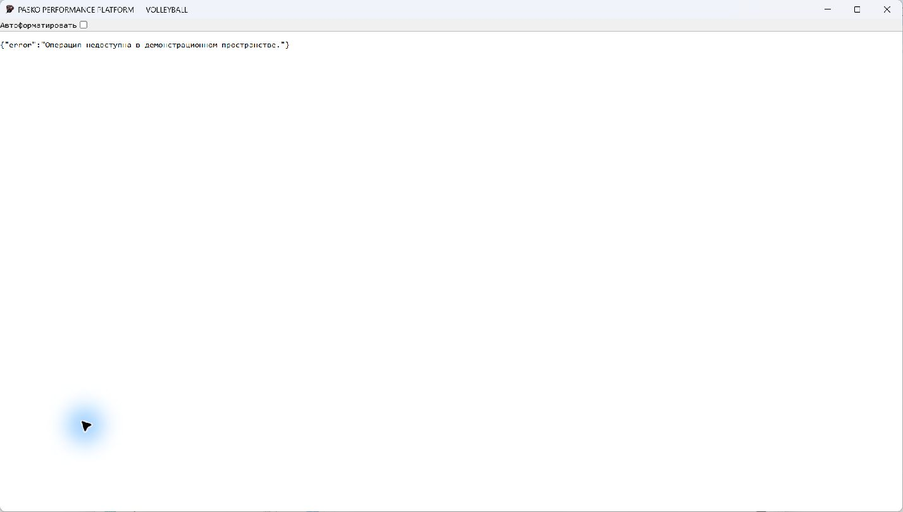

## 15. Тесты, референсы, протоколы и оборудование

Тест определяет код метрики, категорию, единицу, направление и допустимый диапазон. Изменение этих полей влияет на ввод и интерпретацию; не меняйте системные тесты без методологического решения.

`PASKO Reference` — системный read-only профиль. `INSTALLATION_LEGACY` также read-only и не выдаётся за научный reference; локальный администратор может создать независимый профиль организации на его основе. Если протокол сообщает «Протокол пока не заполнен», не додумывайте методику.

Оборудование — справочник средств измерения. Архивируйте неиспользуемое оборудование вместо потери истории.

## 16. Настройки

Настройки содержат оформление клуба, референсы, команду, сезон, статистику, лицензию, безопасность, сведения о продукте, backup/restore и опасную зону.

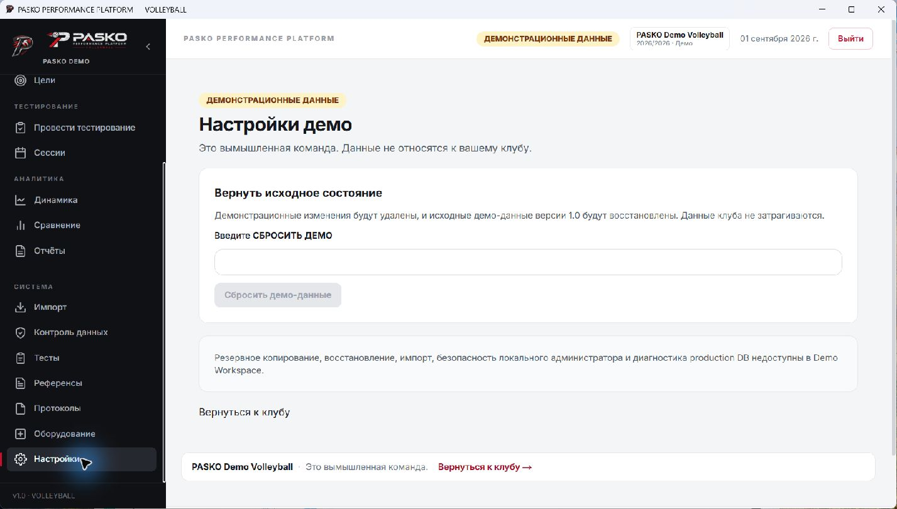

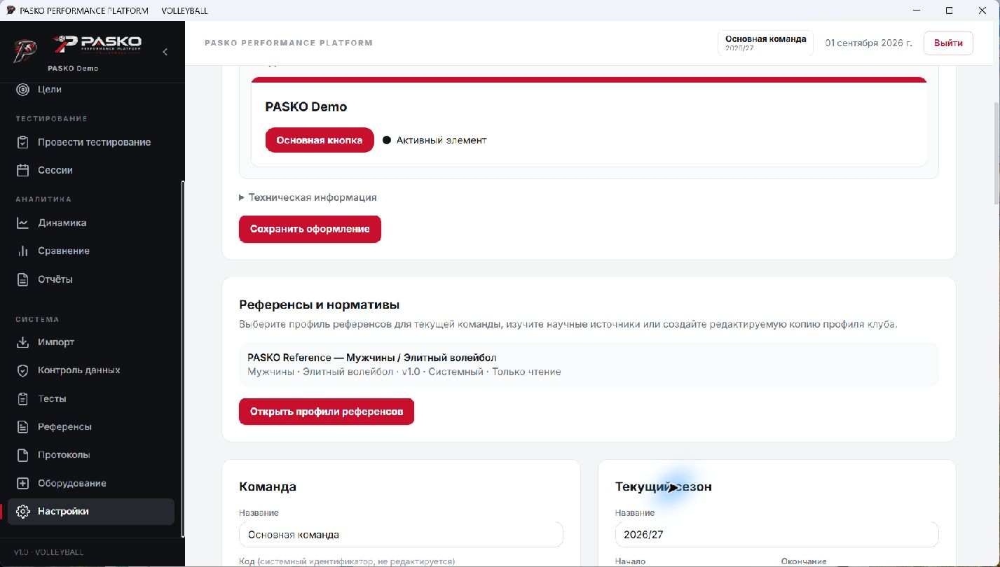
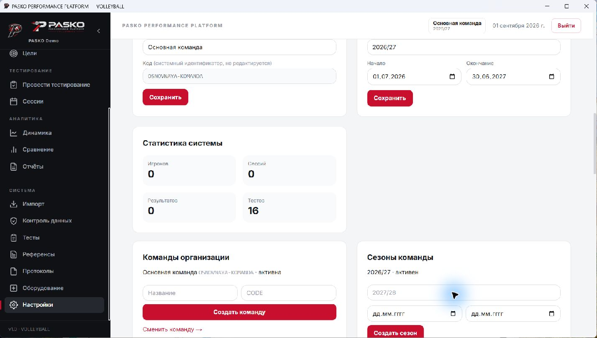

### Лицензирование

В v1.0 лицензия не ограничивает работу приложения. Отображаемый статус лицензии носит информационный характер и не блокирует первоначальную настройку, вход и функции направления VOLLEYBALL.

### Пароль

Для смены введите текущий пароль, новый пароль и подтверждение. Не используйте Recovery Key как обычный пароль.

## 17. Backup, Restore и Reset

Backup installation-wide и включает все организации и команды. Скачайте файл до рискованных действий и храните его зашифрованно.

Restore:

1. Выберите JSON backup.
2. Проверьте предупреждение о полной замене.
3. В управляемом диалоге вручную введите `ВОССТАНОВИТЬ`.
4. Кнопка восстановления активируется только после точного ввода подтверждающей фразы и действующего пароля локального администратора.
5. Дождитесь сообщения об успехе и обновления данных.

Если резервная копия повреждена, несовместима или содержит ошибку, восстановление должно быть отменено без частичного изменения данных. **Reset** удаляет рабочие данные всех команд, сохраняя справочники; используйте его только после создания резервной копии.

## 18. Диагностика и поддержка

Экран показывает версию приложения, состояние локальной базы данных и служебную информацию для диагностики. Диагностический архив не должен содержать дамп базы данных или персональные данные игроков; перед отправкой всё равно проверьте его содержимое.

## 19. Demo Workspace

Demo использует отдельную БД и вымышленных игроков. Вход выполняется из клуба через текущую локальную сессию, отдельный пароль не нужен. Демо-временная шкала фиксируется относительно даты инициализации/сброса и не сдвигается при каждом запуске. **Сбросить демо-данные** изменяет только демонстрационные данные.

## 20. Обновление и переустановка

Перед обновлением скачайте backup и зафиксируйте SHA-256 доверенного установщика. Используйте официальный установщик той же продуктовой линии. Не удаляйте `%LOCALAPPDATA%\PaskoPerformance`: это постоянные данные. Squirrel-каталог `%LOCALAPPDATA%\pasko_performance` содержит приложение и обновляется установщиком.

## 21. Частые проблемы

- **Нет профиля:** проверьте QC, дату не в будущем, unit и совместимость reference.
- **Ось отсутствует:** возможно, нет утверждённого числового референса; это не ноль.
- **Импорт не работает в Demo:** это ожидаемо; вернитесь в Club Workspace.
- **Не видно новой сессии:** проверьте активную команду/сезон и фильтр.
- **Не удаётся войти:** после серии неверных попыток подождите некоторое время или воспользуйтесь восстановлением доступа.
- **Проблема с базой данных:** не удаляйте каталоги приложения; откройте диагностику и сформируйте диагностический архив.
- **Второй запуск сразу завершился:** приложение допускает только одно активное окно; вернитесь к уже открытому окну.

## 22. FAQ

**Можно ли сравнивать ProfileScore с percentile?** Нет, это разные шкалы.

**Почему сила пустая при наличии приседа/тяги?** В v1.0 для этих метрик нет утверждённого числового reference; значения сохраняются как результаты, но score не фабрикуется.

**Можно ли использовать будущую дату измерения?** Запланированные события допустимы только там, где это предусмотрено. Будущий completed result не участвует в current/history.

**Нужна ли лицензия v1.0?** Нет, enforcement отключён централизованно.

**Можно ли удалять базу при переустановке?** Нет. Сначала backup и диагностика.

## 23. Глоссарий

- **PB** — персональный рекорд по подтверждённым данным.
- **QC PASSED/FAILED** — допуск/недопуск результата к расчётам.
- **ProfileScore** — стандартизированный балл 50 + 10z.
- **Empirical percentile** — положение в эмпирическом распределении.
- **Published distribution** — mean/SD из опубликованного источника.
- **Context only** — показатель без утверждённого числового score.
- **Soft-delete** — логическое удаление с возможностью восстановления.
- **Recovery Key** — секрет аварийного восстановления локального администратора.
- **Support bundle** — технический пакет диагностики без дампа БД.
## Приложение: visual acceptance Phase 2

Для v1.0.0 отдельно воспроизведены First Run, login/recovery, создание игрока и полный штатный Backup → Reset → Restore в изолированной тестовой установке. Восстановление требует точной строки `ВОССТАНОВИТЬ` и действующего пароля локального администратора. Demo Workspace проверен отдельно; его данные не относятся к клубу, а возврат выполняется ссылкой «Вернуться к клубу».

См. кадры 041–102 в `SCREENSHOT_GALLERY.md` и матрицу `SCREEN_COVERAGE.md`.
